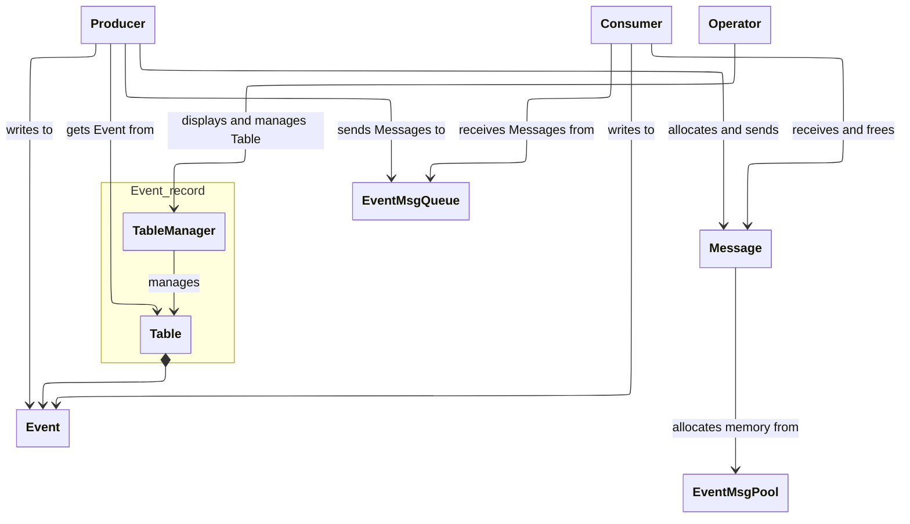

# Introduction
This project is an example client of these libraries:
- [event_recorder](https://github.com/ferdi-pienaar/event_recorder)
- [seq_buf_pool](https://github.com/ferdi-pienaar/seq_buf_pool)
- [strqueue](https://github.com/ferdi-pienaar/strqueue)

The producer thread creates an event and writes the begin-time of event-processing to an entry in an event_recorder Table. The producer then sends a reference to the event in a message that's received by the consumer thread. The consumer thread updates the event in the event_recorder Table with the end-time of the event processing.

The operator can display the recorded events, showing the varying delays between the beginning and end of event-handling.



# Building
To use libraries installed in non-standard location, configure like this:

```sh
cmake -S . -B build -DCMAKE_PREFIX_PATH=<install/path>
```
